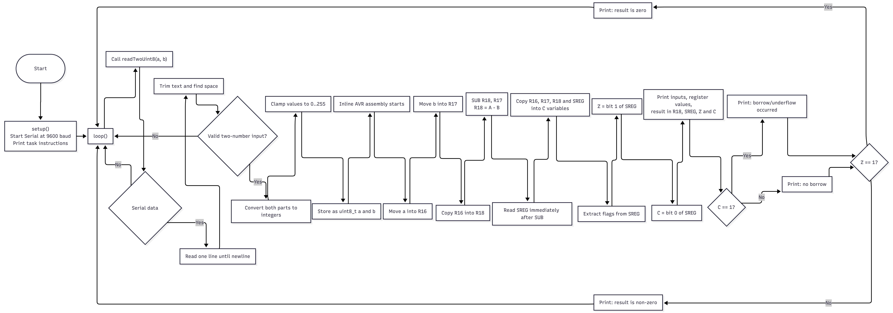

**Course:** Microprocessor Systems (ENCE-4731 - 20919) 
**Instructor:** Dr. Alexz Farrall  
**Lab Number & Title:**  Lab 2 - Registers
**Student Name:** Farid Ibadov  
**Student ID:** 17954  
**Program / Section:** BSCE26  
**Date:** March, 2026

---

## 1. Lab Requirements

Create a serial interface for subtracting two numbers using CPU registers only, store the result in a register, and output all register values.
You must then examine the SREG status register and clearly identify the state of the Zero (Z) and Carry (C) flags after the subtraction.
Evidence the SREG behavior and explain why these flags are set or cleared for this operation, with particular emphasis on how the AVR represents underflow in unsigned subtraction and how the Carry flag behaves during subtraction.

## 2. Code Overview

```cpp
#include <Arduino.h>

static bool readTwoUint8(uint8_t &a, uint8_t &b) {
  if (!Serial.available()) return false;
  String line = Serial.readStringUntil('\n');
  line.trim();
  if (line.length() == 0) return false;

  int space = line.indexOf(' ');
  if (space < 0) return false;

  long x = line.substring(0, space).toInt();
  long y = line.substring(space + 1).toInt();

  if (x < 0) x = 0; if (x > 255) x = 255;
  if (y < 0) y = 0; if (y > 255) y = 255;

  a = (uint8_t)x;
  b = (uint8_t)y;
  return true;
}

void setup() {
  Serial.begin(9600);
  while (!Serial) {}

  Serial.println("Task 2: SUB using CPU registers (R16,R17,R18) + read SREG.");
  Serial.println("Enter: a b  (0..255), e.g. 10 3 or 3 10 or 5 5");
}

void loop() {
  uint8_t a, b;
  if (!readTwoUint8(a, b)) return;

  uint8_t r16_val = 0, r17_val = 0, r18_val = 0;
  uint8_t sreg_after = 0;

  asm volatile(
    "mov r16, %[A]       \n\t"
    "mov r17, %[B]       \n\t"
    "mov r18, r16        \n\t"
    "sub r18, r17        \n\t"
    "in  %[S], __SREG__  \n\t"
    "mov %[O16], r16     \n\t"
    "mov %[O17], r17     \n\t"
    "mov %[O18], r18     \n\t"
    : [O16] "=r"(r16_val),
      [O17] "=r"(r17_val),
      [O18] "=r"(r18_val),
      [S]   "=r"(sreg_after)
    : [A] "r"(a),
      [B] "r"(b)
    : "r16", "r17", "r18"
  );

  bool Z = (sreg_after & (1 << 1)) != 0;
  bool C = (sreg_after & (1 << 0)) != 0;

  Serial.println("---- Result ----");
  Serial.print("Input A="); Serial.print(a); Serial.print(" (0x"); Serial.print(a, HEX); Serial.println(")");
  Serial.print("Input B="); Serial.print(b); Serial.print(" (0x"); Serial.print(b, HEX); Serial.println(")");

  Serial.print("R16="); Serial.print(r16_val); Serial.print("  R17="); Serial.print(r17_val);
  Serial.print("  R18(A-B)="); Serial.print(r18_val); Serial.print(" (0x"); Serial.print(r18_val, HEX); Serial.println(")");

  Serial.print("SREG=0x"); Serial.println(sreg_after, HEX);
  Serial.print("Z="); Serial.print(Z ? "1" : "0");
  Serial.print("  C="); Serial.println(C ? "1" : "0");

  if (C) Serial.println("C=1 means occurred (unsigned underflow: A < B).");
  else   Serial.println("C=0 means no borrow (A >= B).");

  if (Z) Serial.println("Z=1 means result is exactly zero.");
  else   Serial.println("Z=0 means result is non-zero.");

  Serial.println();
}
```

The program takes two integer number values from the serial monitor and limits to the range from 0 to 255, storing as `uint8_t` - unsigned 8-bit integer. Limiting is done due to the fact that we work with 8-bit register. Actual subtraction is done using registers in inline AVR assembly block - key point of the lab, register manipulation and flag observing.

In AVR assembly we have:
`mov r16, %[A]` it loads input a into the register `R16`
`mov r17, %[B]`  b into `R17`
`mov r18, r16` copies a into `R18`
`sub r18, r17` performs subtraction `R18 = R16 - R17`
`in %[S], __SREG__` reads the status register value immediately after subtraction

## 3. Register and Bit Explanation


`r16` has address of 0x10, `r17` - 0x11, `r18` - 0x12. 
Code check 2 SREG bits: bit 1 is **Z** and bit 0 is **C**


The AVR instruction manual states that for `SUB`, **Z** is set if the result is `0x00`, while **C** is set when a **borrow** occurs.

## 4. Why results are Correct

When **A > B** - no borrow can happen logically, so **C** is **0**, since result is non-zero so  **Z** is **0** as well
When **A = B**  result is `0`, so **Z** is **1**, **C** is **0**
When **A < B** - AVR unsigned subtraction wraps around modulo 256, so the result underflows and **C** is **1**, **Z** is **0**

examples:



